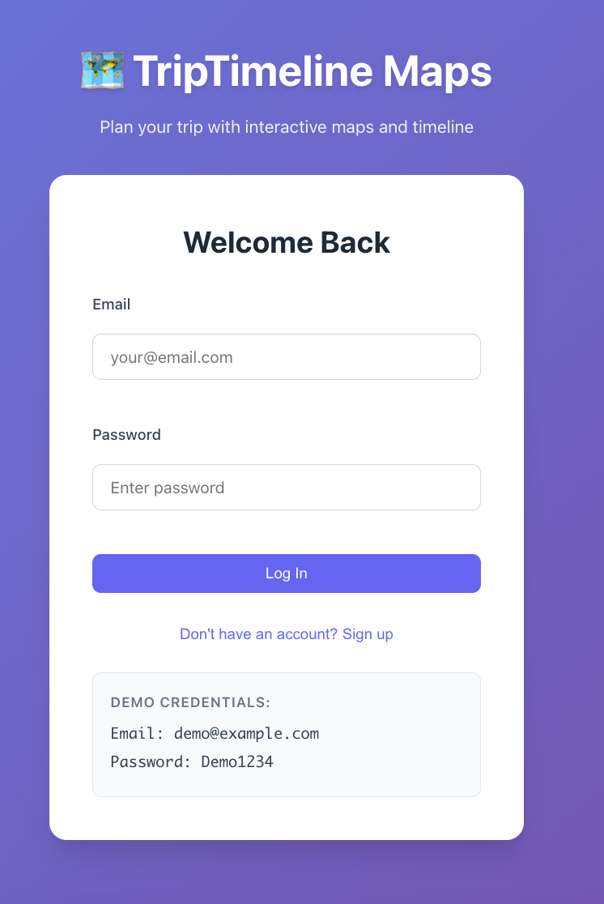
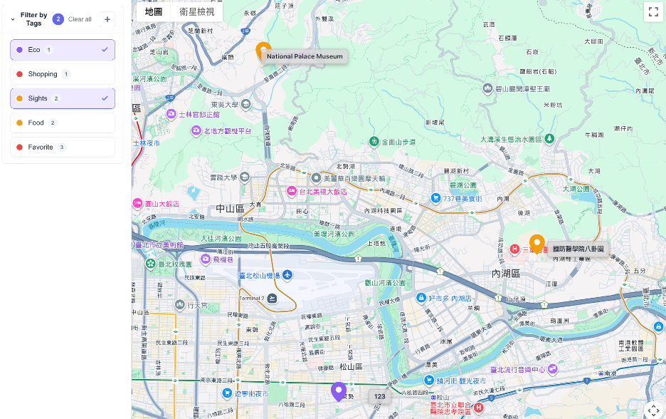
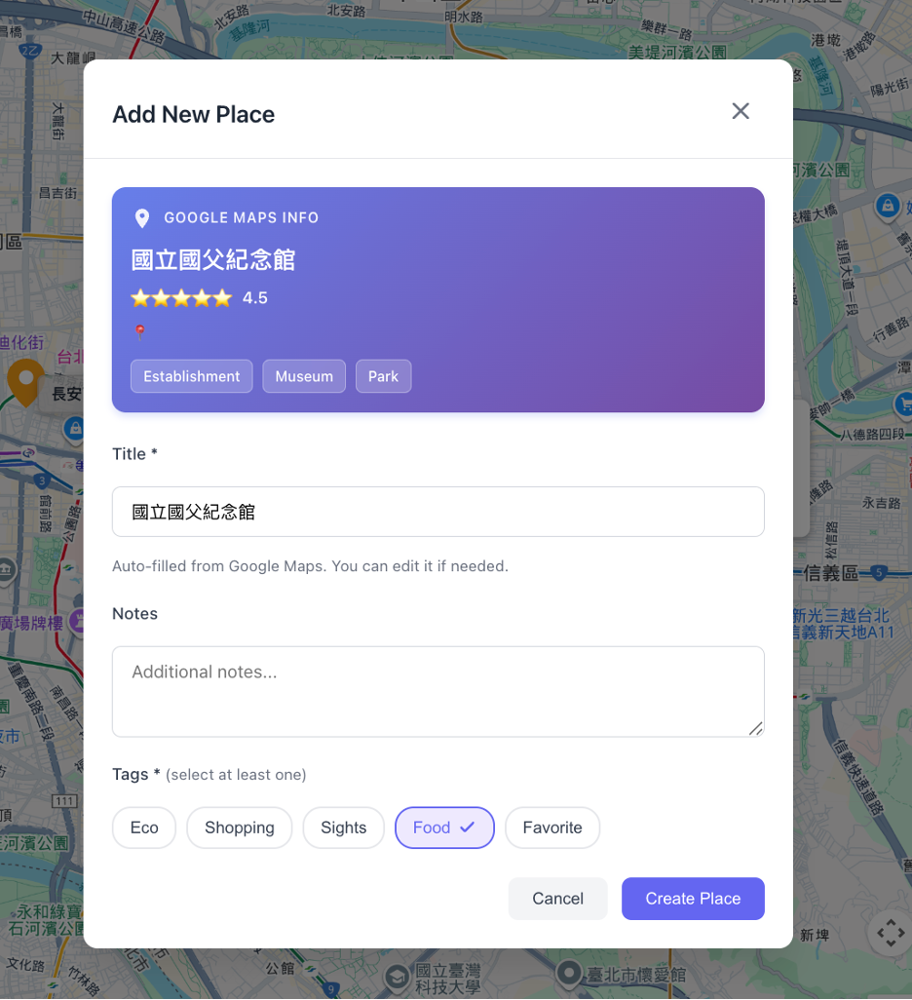
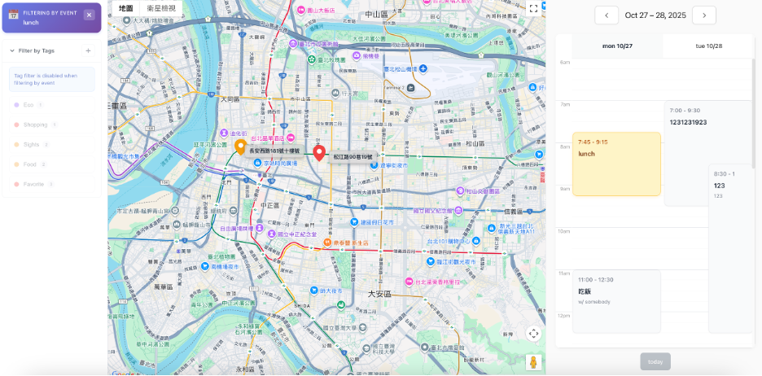

# 🗺️ TripTimeline Maps

> Map-first trip planning application with timeline scheduling

## 1. 專案介紹（Project Overview）

TripTimeline 是一個**結合地圖與時間軸的旅行管理應用**，讓使用者能在互動式地圖上管理旅行地點，並在時間軸中安排行程，形成地點與時間同步的旅程規劃方式。

這是一個 **全端分離架構**（React + Node.js + PostgreSQL），並整合 Google Maps Platform 提供地圖視覺化與地點資料能力。

## 2. 問題背景與動機（Problem & Motivation）

傳統規劃行程的方式常依賴 Google 文件與 Maps 交互切換，造成以下痛點：

* 需要多開頁面或分頁整理資訊，**沒有統一的行程視覺化界面**。
* 地點與時間是分離的資訊，不便管理整體旅行節奏。
* 地點資訊重複搜尋、貼連結，不方便團隊共同規劃或視覺理解。
* 缺少**快速查看地點距離與相對位置**的方式。

## 3. 目標使用者（Target Users）

| 使用者類型        | 使用情境                    |
| ------------ | ----------------------- |
| 小團體旅行規劃者     | 規劃 2–5 人旅遊行程，視覺化安排天數與路線 |
| 個人出遊      | 設定景點與餐廳，檢視距離以避免舟車勞頓     |

## 4. 核心功能（Core Features）

### 登入功能



後端用 JWT 實現登入。

### 地圖與標記管理（Places 系統）

* 使用 Google Maps 顯示地圖
* 新增地點（可以從地圖點擊或搜尋加入）
* 每個地點必須至少有**一個 Tag**
* 支援自訂分類（Tag）




### 行程管理（Events 系統）

* 支援時間區間的行程安排
* 使用 FullCalendar 顯示時間軸
* 行程與地點可關聯
* 點擊行程可在地圖聚焦顯示相關地點



```
使用者登入 → 進入地圖頁面 → 建立地點 → 依 Tag 分類呈現 → 建立行程 → 將地點加入行程 → 顯示地圖與時間軸連動
```

## 6. 系統架構概述（System Architecture）

```
Frontend (React + Vite + TS)
    ├── Google Maps JS SDK (地圖顯示)
    ├── FullCalendar (時間軸)
    └── Axios → 呼叫 Backend API
Backend (Node.js + Express + Swagger)
    ├── Auth / Places / Tags / Events REST API
    ├── JWT 驗證 + Session via HttpOnly Cookie
    ├── Google Maps API Call Proxy
    └── Prisma ORM + PostgreSQL
Database (PostgreSQL)
    ├── users / places / tags / place_tags
    ├── events / event_places
    └── 每個使用者擁有自己的規劃資料
```


## 7. Google Maps Integration（整合設計）

| 使用場景     | Google API          | 說明            |
| -------- | ------------------- | ------------- |
| 地圖顯示     | Maps JavaScript API | 顯示地圖 / Marker |
| 搜尋地點     | Places API          | 用於找地點         |
| 地址轉座標    | Geocoding API       | 儲存地點用         |

## 8. 快速開始

### 前置需求

- [Docker Desktop](https://www.docker.com/products/docker-desktop)
- [Google Maps API Key](https://console.cloud.google.com/apis/credentials)
- makes

### 步驟一：設置環境變數

**後端（`backend/.env`）：**
```bash
cp backend/.env.example backend/.env
# 編輯並填入你的 Google Maps API 伺服器金鑰
```

**前端（`frontend/.env`）：**
```bash
cp frontend/.env.example frontend/.env
# 編輯並填入你的 Google Maps API 瀏覽器金鑰
```

### 步驟二：產生假資料

```bash
make seed
```

服務會在資料庫產生：

```
👤 Creating demo user...
  ✓ Demo user created: demo@example.com

🏷️  Creating default tags...
  ✓ Favorite tag created
  ✓ Tag created: Food
  ✓ Tag created: Sights
  ✓ Tag created: Shopping

📍 Creating demo places...
  ✓ Place created: Din Tai Fung (Xinyi) (2 tags)
  ✓ Place created: National Palace Museum (1 tags)

📅 Creating demo events...
  ✓ Event created: Lunch at Din Tai Fung (1 places)

📊 Database Summary:
  Users: 1
  Tags: 5
  Places: 8
  Events: 9
```

### 步驟三：啟動服務

```bash
make dev
```

### 步驟四：訪問應用

- 前端：http://localhost:5173
- 後端 API：http://localhost:3000
- API 文檔：http://localhost:3000/api-docs
- 測試帳號：
  - Email: demo@example.com
  - Password: Demo1234s

---

## 📖 文件導覽

### 首次使用
- **[docs/QUICKSTART.md](./docs/QUICKSTART.md)** - 詳細的快速開始指南，包含 Google Maps API 申請步驟
- **[docs/FEATURES.md](./docs/FEATURES.md)** - 完整功能說明與使用方式

### 技術文檔
- **[docs/ARCHITECTURE.md](./docs/ARCHITECTURE.md)** - 技術架構與設計決策
- **[docs/API_EXAMPLES.md](./docs/API_EXAMPLES.md)** - API 使用範例與 curl 命令
- **[docs/DEPLOYMENT.md](./docs/DEPLOYMENT.md)** - 生產環境部署指南

### 開發參考
- **[docs/TESTING_GUIDE.md](./docs/TESTING_GUIDE.md)** - 測試案例與流程
- **Makefile** - 常用開發指令
- **docker-compose.yml** - Docker 服務配置

---

## 🏗️ 技術棧

**前端**
- React 18 + TypeScript
- Vite
- React Router
- FullCalendar (TimeGrid)
- Google Maps JavaScript API

**後端**
- Node.js 20 + TypeScript
- Express 4
- Prisma 5 (ORM)
- PostgreSQL 15
- JWT (HTTP-only Cookies)
- Zod 驗證

---

## 🔑 核心功能

1. **地圖互動** - Google Maps 點擊建立地點、標記顯示、篩選
2. **標籤系統** - 多標籤組織地點、Tag-based 篩選
3. **時間軸** - FullCalendar TimeGrid 日程安排、拖曳調整
4. **認證授權** - JWT + Refresh Token、自動刷新
5. **資料不變式** - Place 必須至少有 1 個 Tag

---

## 🛠️ 開發指令

| 指令 | 說明 |
|------|------|
| `make dev` | 啟動所有服務 |
| `make stop` | 停止所有服務 |
| `make build` | 重新建置容器 |
| `make logs` | 查看服務日誌 |
| `make seed` | 填充測試資料 |
| `make shell-backend` | 進入後端容器 |
| `make db` | 開啟 PostgreSQL CLI |

---

## 📚 完整文檔

詳細的使用指南、API 文檔與技術說明都在 `docs/` 目錄：

```
docs/
├── QUICKSTART.md      - 詳細快速開始指南
├── FEATURES.md        - 功能說明與使用範例
├── ARCHITECTURE.md    - 技術架構與設計決策
├── API_EXAMPLES.md    - API 使用範例（10+ curl）
├── DEPLOYMENT.md      - 生產部署指南
└── TESTING_GUIDE.md   - 測試案例與流程
```

---

## 🐛 疑難排解

遇到問題？查看 **[docs/QUICKSTART.md](./docs/QUICKSTART.md)** 的「常見問題」章節。

---

## 📄 授權

MIT License

---

**需要協助？** 查看 `docs/` 目錄中的詳細文檔。
